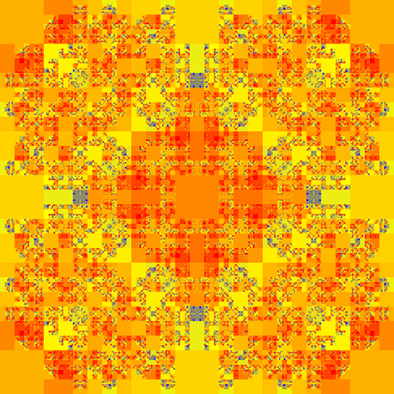

# Introduction

### What is it?

Much like how the famous [Mandelbrot set](https://en.wikipedia.org/wiki/Mandelbrot_set) beautifully represents the complexity born out of a simple set of rules. Faze aims to create similar images from the rules of games, where zooming into the image is equivalent to exploring a sequence of moves in the game. 

### Who is it for?

Faze is mostly for [me](https://github.com/b-hub). I wanted a way to visualise how complex and massive games can be from very simple rules. You often hear how games like chess have more ways to play than there are atoms in the universe, but that's quite a hard thing to grasp. By visualising games as fractals I could create an image and go - "you know all those possible ways to play chess? Well it's in that image... somewhere. 

Faze is a tool for helping explore the complexity of games. If you like fractals, games, AIs and visualising data then Faze is also for **you**.

### How does it work?

Fractals by nature are recursive and so is the way computers explore games to find optimal solutions! Using fractals, I wanted to create a way to illustrate how a computer may 'see' a game, to highlight moves it thinks are better than others. Depending on how you approach this, the images produced can not only be a representation of what a computer sees, but also a visualisation of the game itself.

This documentation is currently a work in progress, but I have written some blog posts explaining the concept:





