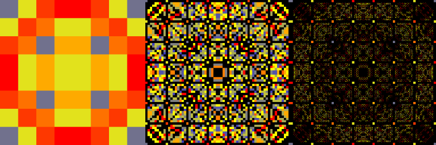
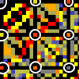

# 8 Queens Problem

> The [**eight queens puzzle**](https://en.wikipedia.org/wiki/Eight_queens_puzzle) is the problem of placing eight [chess](https://en.wikipedia.org/wiki/Chess) [queens](https://en.wikipedia.org/wiki/Queen_%28chess%29) on an 8×8 [chessboard](https://en.wikipedia.org/wiki/Chessboard) so that no two queens threaten each other; thus, a solution requires that no two queens share the same row, column, or diagonal.



The above images represent the distribution of solutions for the eight queens puzzle. The original images can be viewed in the [gallery](https://b-faze.github.io/faze/Eight-Queens-Problem.html).

## Pipeline Summary

### Data Pipeline

```csharp
ReversePipelineBuilder.Create()
    .SaveTree(EightQueensProblemExhaustiveDataPipeline.Id, treeDataProvider)
    .Map(resultsMapper)
    .LimitDepth(3)
    .GameTree(new SquareTreeAdapter(BoardSize))
    .Build(() => new PiecesBoardState(new PiecesBoardStateConfig(BoardSize, new QueenPiece(), onlySafeMoves: true)));
```

### Render Pipeline

```csharp
ReversePipelineBuilder.Create()
    .GallerySave(galleryService, galleryMetaData)
    .Render(new SquareTreeRenderer(rendererConfig))
    .Paint(painter)
    .LoadTree(EightQueensProblemExhaustiveDataPipeline.Id, treeDataProvider);
```

## Pipeline Breakdown

### Game

The game rules are handled by the `PiecesBoardState` type using the following configuration:

| Property | Value | Description |
| :--- | :--- | :--- |
| Dimension | 8 | Size of the board |
| Piece | QueenPiece |  |
| OnlySafeMoves | true | Game state will only return moves that do not attack existing queens |

### Results Tree Mapper

Next the results mapper \(`EightQueensProblemSolutionTreeMapper`\) will take the game tree and transform it into a tree containing the results we can use generate the visualisation. In this case we are given a game tree 3 moves deep and then collect our results using the `EightQueensProblemSolutionAggregate` type.

```csharp
private static Tree<EightQueensProblemSolutionAggregate> MapTreeAgg(Tree<IGameState<GridMove, SingleScoreResult?>> tree)
{
    if (tree == null)
        return null;


    if (tree.IsLeaf())
    {
        var resultAgg = AggregateResults(tree.Value);
        return new Tree<EightQueensProblemSolutionAggregate>(resultAgg);
    }

    var children = tree.Children.Select(x => MapTreeAgg(x)).ToList();

    var treeValue = new EightQueensProblemSolutionAggregate();    
    foreach (var childValue in children.Where(x => x != null).Select(x => x.Value))
    {
        treeValue.Add(childValue);
    }

    return new Tree<EightQueensProblemSolutionAggregate>(treeValue, children);
}
```

### Tree Painter

We then have a tree painter \(`EightQueensProblemPainter`\) which maps the results tree into a colour tree. 

```csharp
private Tree<Color> Paint(Tree<EightQueensProblemSolutionAggregate> tree, TreeMapInfo info, uint maxSiblingWins)
{
    if (tree == null)
    {
        return info.Parent.ChildIndex == info.ChildIndex 
            ? null 
            : new Tree<Color>(Color.Black);
    }

    var value = maxSiblingWins > 0 
        ? (double)tree.Value.Wins / maxSiblingWins 
        : 0;
        
    var color = value > 0 
        ? colorInterpolator.GetColor(value) 
        : Color.Black;

    if (tree.IsLeaf())
        return new Tree<Color>(color);

    var maxChildrenWins = tree.Children.Where(c => c != null).Select(x => x.Value.Wins).Max();
    var children = tree.Children.Select((c, i) => Paint(c, info.Child(i), maxChildrenWins));

    return new Tree<Color>(color, children);
}
```

The EightQueensProblemPainter normalises the number of wins of a tree node against the maximum value of its siblings. 

E.g. if we have 3 child nodes: \[100, 10, 50\], the normalised result will be \[100/100, 10/100, 50/100\] or \[1, 0.1, 0.5\]

The [GoldInterpolator](../rendering/color-interpolators.md#gold) then takes this normalised value and converts it to a colour.

All unavailable moves will be coloured black, with the exception of moves that are the same as the previous. The relevant code segment is here:

```csharp
    if (tree == null)
    {
        return info.Parent.ChildIndex == info.ChildIndex 
            ? null 
            : new Tree<Color>(Color.Black);
    }
```

Returning a null node instead which will be ignored by the renderer.  This means the null nodes will be coloured according to the parent's results which acts like a summary at each depth:



### Tree Renderer

The `SquareTreeRenderer` fits very nicely with this type of problem as it is played on a 8x8 board.

| Property | Value |
| :--- | :--- |
| MaxDepth | 1, 2 and 3 |

