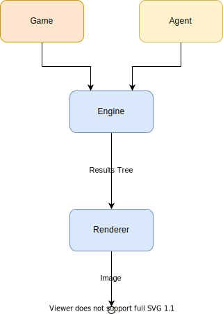

# Overview

At its core, Faze can be summarised with the following diagram.

The pipeline is made up of two main parts - the **engine** and the **renderer**. The engine provides the data and the renderer draws it.

Faze aims to provide everything except for the game logic as standard, consisting of a default set of tools to allow the user to define their game and focus on exploring it. However, much of the pipeline will be extensible, with the idea of eventually integrating any useful third-party functionality back in.

### Game

Implements `IGameState` which provides the available moves, a new state given a valid move and the result of a game. With this simple model it is possible for a generic engine to simulate and collect results for any implementation.

### Engine

A generic service which provides helpful methods to explore and aggregate results for any given `IGameState`.

### Renderer

In charge of rendering images from tree data structures and keeping track of what portion of the tree needs to be rendered for a given viewport.

