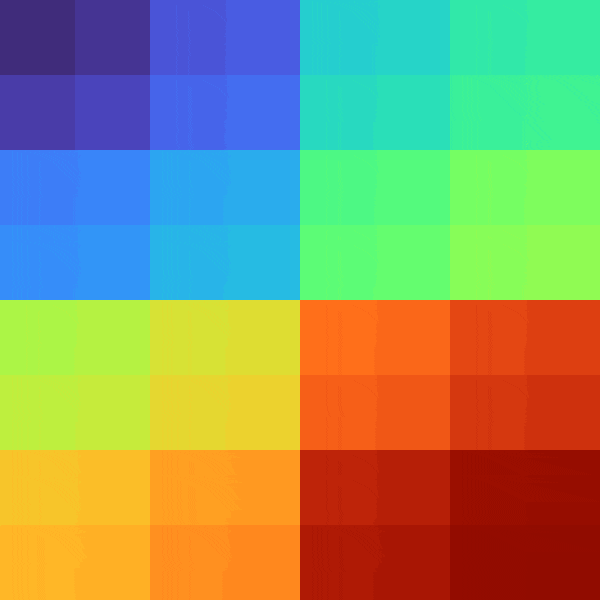

# SquareTreeRenderer

Draws a tree by uniformly subdividing an image into squares. The number of branches at each depth is assumed to be constant and equal to: `SquareTreeRendererOptions.Size * SquareTreeRendererOptions.Size`

### Options

`SquareTreeRendererOptions`

```text
    public int Size { get; }
    public int ImageSize { get; }
    public float BorderProportions { get; set; }
    public float MinChildDrawSize { get; set; }

    public IViewport Viewport { get; set; }
    public int? MaxDepth { get; set; }
```

| Property | Type | Description |
| :--- | :--- | :--- |
| Size | int | Square size. E.g. a Size=2 for 2x2 grid |
| ImageSize | int | Width and Height of the image in pixels |
| BorderProportions | float | Border size at each depth as a fraction of the parent's size |
| MinChildDrawSize | float | Nodes under this pixel size will be ignored by the renderer |
| Viewport | IViewport | Renders only a sub-portion of the image. Used for zooming |
| MaxDepth | int?  | If a value is set, the renderer will ignore nodes past the specified depth |

### Examples

For more applied examples see [8 Queens Problem](../../examples/8-queens-problem.md) and [Chess Pieces](../../examples/chess-pieces.md)

#### Changing BorderProportions




