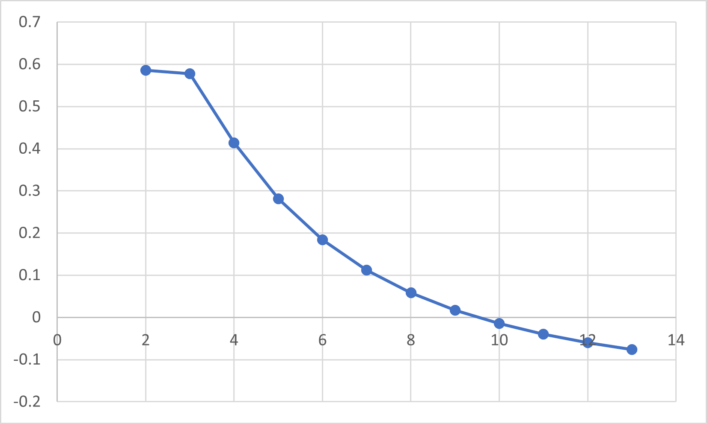
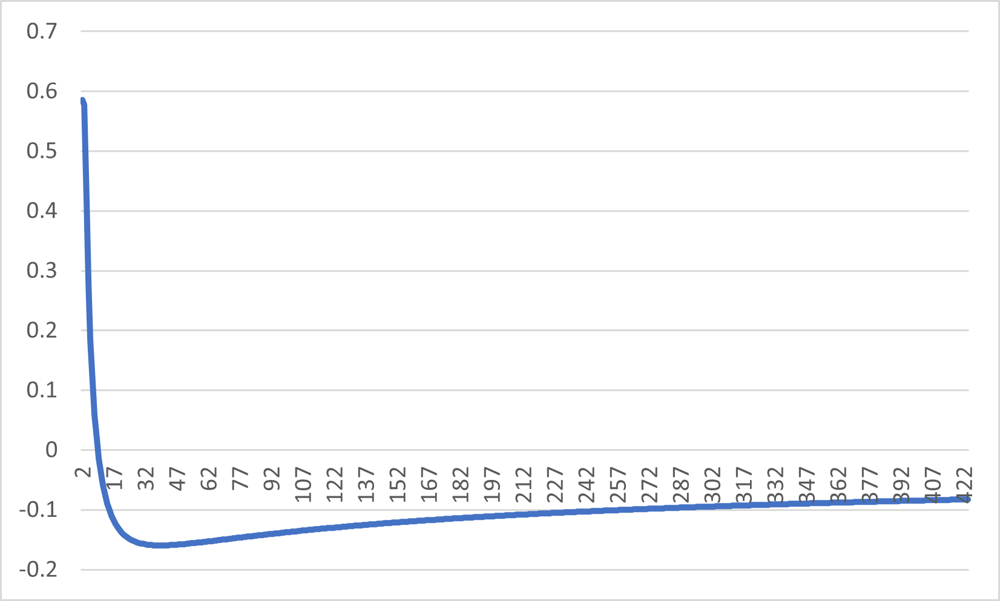
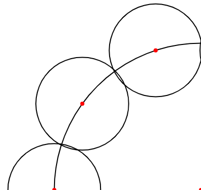
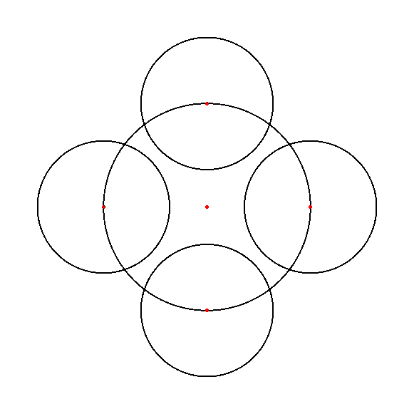

# Circle Edge Renderer

### Core rules

* Each node in the tree is represented with a circle.
* Child nodes are spaced equally along the parent circle's edge.

**Additional rules**

[Maintaining proportional area](https://github.com/b-faze/Faze.Rendering/wiki/Circle-Edge-Renderer-Research#proportionalArea)  
[Defining the gap between children](https://github.com/b-faze/Faze.Rendering/wiki/Circle-Edge-Renderer-Research#definingGap)

### Maintaining proportional area

One restriction could be to make sure the area of the children, directly under the parent, sums to the parent's area.

> $$A_c = \frac{A_p}{n}$$

This can be then written in terms of the radius of parent 'R' and child 'r'. Where n is the number of children R has.

> $$\pi r^2 = \frac{\pi R^2}{n}$$

> $$r = \frac{R}{\sqrt{n}}$$

Given the above restrictions, the results for 1 - 4 children are listed below

&lt;img&gt;

One question is to ask how does this render with more children, particularly if the children ever overlap. To find out we can draw the following diagram.

As stated by one of the core rules, children are equally spaced along the edge of the parent and so the angle between each child is given by theta where...

> $$\theta = \frac{2\pi}{n}$$

The distance between adjacent children center point is can be seen to have the following equality

> $$2r + x = \sqrt{2R^2(1 - \cos(\frac{2\pi}{n}))}$$

where the right hand side comes from the cosine rule 

> $$c^2 = a^2 + b^2 - 2ab\cos{C}$$

> $$(2r + x)^2 = 2R^2 - 2R^2\cos(\frac{2\pi}{n})$$

> $$(2r + x)^2 = 2R^2(1 - \cos(\frac{2\pi}{n}))$$

> $$2r + x = \sqrt{2R^2(1 - \cos(\frac{2\pi}{n}}))$$

Refactoring the equation gives us the following equation for x

> $$x = \sqrt{2R^2(1 - \cos(\frac{2\pi}{n}))} - 2r$$

> $$x = \sqrt{2R^2(1 - \cos(\frac{2\pi}{n}))} - \frac{2R}{\sqrt{n}}$$

> $$x = (\sqrt{2(1 - \cos(\frac{2\pi}{n}))} - \frac{2}{\sqrt{n}})R$$

Plotting the equation shows us x is positive for n &lt; 10

> $$y = \sqrt{2(1 - \cos(\frac{2\pi}{x}))} - \frac{2}{\sqrt{x}}$$

For values of x &lt; 0, the edges of the child circles will overlap. See below for zoomed in image for n=10...

### Defining the gap between children

This method tweaks the equation for the child radius to achieve a desired gap between circle edges. The result of this would be a loss of proportional area, but could be used in conjunction with the previous section to define a lower limit for the gap e.g. limit so x &gt;= 0 where the proportion is only lost in the case of n &gt; 10 where x drops below 0.

> $$2r + x = \sqrt{2R^2(1 - \cos(\frac{2\pi}{n}))}$$

we can modify the equation for x to fix the value

> $$r = \frac{1}{2}R\sqrt{2(1 - \cos(\frac{2\pi}{n}) - x)}$$

Setting the gap size to zero

&lt;img&gt;

